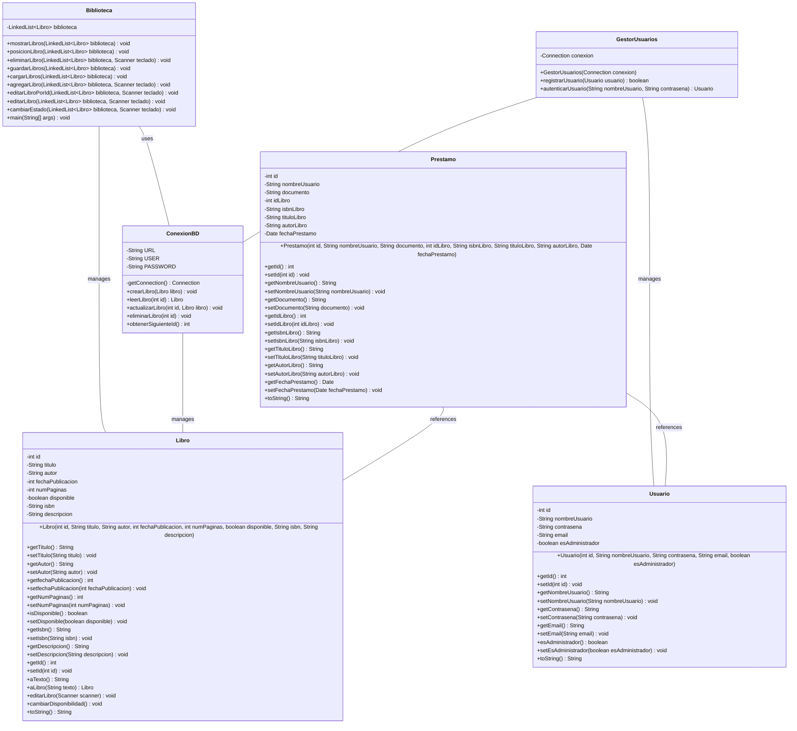

# **PLANEACIÓN**

- Conectar el proyecto a SpringBoot &cross;
- Conectar el proyecto a una base de datos &check;
- Crear interfaz gráfica &cross;
- Crear un diagrama de clases &check;
- Cambiar los arrays por listas &check;
- Crear base de datos simulada con archivo .txt &check;
- Crear una clase para el préstamo de un libro a un usuario &check;

---

# **Tabla de Contenido**

1. [Descripción Actual](#descripción-actual)
2. [Modo de Uso](#modo-de-uso)
   - [Requisitos](#requisitos)
   - [Clases Principales](#clases-principales)
   - [Instalación](#instalación)
   - [Funcionalidades del Programa](#funcionalidades-del-programa)
   - [Limitaciones](#limitaciones)
3. [Soporte](#soporte)
4. [Errores Anteriores Solucionados](#errores-anteriores-solucionados)
5. [Errores Conocidos](#errores-conocidos)
6. [Progreso Actual con los Errores](#progreso-actual-con-los-errores)
7. [Cambios](#cambios)
8. [Diagrama de clases](#diagrama-de-clases)

---

# **DESCRIPCIÓN ACTUAL**

Este repositorio contiene un software de gestión de biblioteca que se conecta a una base de datos MySQL a través de JDBC para gestionar operaciones CRUD (Crear, Leer, Actualizar, Eliminar) de libros. También incluye persistencia en archivos `.txt` como respaldo.

El proyecto utiliza **XAMPP** para gestionar la base de datos MySQL con **phpMyAdmin** y el conector JDBC para la interacción con la base de datos desde Java.

---

# **MODO DE USO**

## Requisitos

Para ejecutar este proyecto, es necesario:

1. **Conector JDBC**:  
   Descargue e instale el conector JDBC desde la página oficial de MySQL:  
   [MySQL Connector/J](https://dev.mysql.com/downloads/connector/j/)

2. **Base de datos MySQL**:
   - Crear una base de datos con el nombre `biblioteca`.
   - Dentro de esta base de datos, cree las tablas necesarias como `libros`.

3. **Entorno de desarrollo**:
   - Un IDE que soporte Java (Eclipse, IntelliJ IDEA, NetBeans, etc.).
   - Incluir el archivo JAR del conector JDBC en su proyecto para la conexión a la base de datos.

## Clases Principales

En su IDE, deberá crear las siguientes clases:

- `Biblioteca.java`: Clase principal del proyecto que gestiona las operaciones de la biblioteca.
- `ConexionDB.java`: Clase responsable de la conexión con la base de datos MySQL y la ejecución de las consultas.
- `Libro.java`: Clase que representa los objetos de tipo libro en el sistema.
- `GestorUsuarios.java`: Clase responsable de registrar usuarios.
- `Prestamo.java`: Clase que representa los objetos de tipo préstamo de libros.
- `Usuario.java`: Clase que representa a los usuarios.

### Detalles de Clases

#### ConexionDB.java

Esta clase maneja toda la lógica de conexión con la base de datos. Sus métodos son llamados desde `Biblioteca.java` para realizar operaciones como agregar, editar y eliminar libros.

#### Biblioteca.java

Es el punto de entrada del programa y coordina las interacciones entre la interfaz de usuario y la base de datos.

#### GestorUsuarios.java

Maneja la lógica para la creación de usuarios en la base de datos.

#### Prestamo.java

Gestiona los préstamos realizados por los usuarios, registrándolos en la base de datos.

#### Usuario.java

Crea objetos de tipo usuario.

#### Libro.java

Crea y edita objetos de tipo libro.

## Instalación

1. **Instalar MySQL y XAMPP**:
   - Instale XAMPP y active **MySQL** y **Apache**.

2. **Configurar la base de datos**:
   - Cree la base de datos `biblioteca` y las tablas necesarias como `libros`, `devoluciones`, `prestamos`, `usuarios`.

3. **Configuración del proyecto**:
   - Asegúrese de que el conector JDBC esté correctamente configurado en su IDE.
   - `ConexionDB.java` manejará la conexión a la base de datos.

## Funcionalidades del programa

- **Gestión de libros**: Agregar, editar y eliminar libros en la base de datos.
- **Persistencia**: Genera un archivo `.txt` con los libros registrados.
- **Conexión a base de datos**: Mediante JDBC.
- **Creación de usuarios**: Permite crear usuarios y administradores.

## Limitaciones

- Limitaciones en la lógica de ingreso de usuarios y manejo de la base de datos.
- Más funcionalidades pueden ser añadidas en futuras versiones.

## Soporte

- Para dudas o problemas, puede ponerse en contacto por cualquier medio disponible.
- [Reportar Error](https://github.com/DanielRestrepoGaleano/BibliotecaJava/issues)
- [PQRS](https://docs.google.com/forms/d/1OxRtiVPGTAUtvkKE_opcWedZ7b5dZMVU5F3T7YdZRw0)
- La carpeta "GUIA DE IMAGENES" incluye imágenes de ayuda para la instalación y configuración.

---

# **ERRORES ANTERIORES SOLUCIONADOS**

- Error con el `Scanner` (`NoSuchElementException`) &check;
- Error con arrays (`InputMismatchException`) &check;
- Error en el guardado de libros &check;
- Error cuando se muestra un libro en la terminal &check;
- Error con la carga de los archivos `.txt` &check;
- Los libros editados no se reflejaban en el archivo `.txt` &check;
- Error al cargar los libros generando excepciones &check;
- Error al editar la fecha de publicación de un libro (`NumberFormatException`) &check;
- Problema con el guardado persistente de libros &check;

---

# **ERRORES CONOCIDOS**

- Hasta el momento, no se han identificado más errores.

---

# **PROGRESO ACTUAL CON LOS ERRORES**

El error con los archivos ha sido mitigado, pero persiste en menor grado. Se logró que el programa actualice los archivos `.txt`, aunque los libros no se cargan correctamente, lo que provoca una pérdida de datos.

(27/08/2024) - Mitigado el error al cargar los libros.  
(04/09/2024) - No hay errores con el guardado y cargado de libros actualmente.

---

# **CAMBIOS**

---

**08/08/2024 - 3:00 PM**  

- Se realizaron cambios en la estructura de las funciones.
- Se asignaron nombres más claros y fueron enviadas a las clases correspondientes.

**08/08/2024 - 10:50 PM**  

- Guardado de libros en un archivo `.txt` como base de datos temporal.

**09/08/2024 - 6:00 PM** 

- Cambios importantes en la estructura de las funciones.
- Añadido el guardado de libros mediante archivos `.txt`.

**27/08/2024 - 1:33 PM**  

- Cambios en las funciones `cargarLibros`, `guardarLibros` y `aTexto` (de la clase `Libro`).
- Cambio de arrays a listas.

**04/09/2024 - 5:30 PM**  

- Cambio de `System.out` por `LOGGERS` para mayor organización del código.

**07/09/2024 - 10:30 PM**  

- Añadida una nueva clase y una API en PHP para la conexión a la base de datos local en `phpMyAdmin`.
- Funciona el método de agregar en la base de datos.

**10/09/2024 - 10:37 AM**  

- Implementados métodos básicos del CRUD en la base de datos.
- Eliminado PHP debido a dificultades con su conexión.
- `ConexionDB.java` ahora realiza toda la conexión.
- Instaladas dependencias de MySQL Connector/J.

**11/09/2024 - 10:45 AM**  

- Arreglado el método para editar libros en la base de datos.  
**05:47 PM**  
- Añadido el login de usuarios con su respectiva conexión a la base de datos.

**14/09/2024 - 11:03 PM**  
- Implementado el préstamo de libros.

- Nueva tabla `libros` en la base de datos.
- Actualizada la documentación con Javadoc.

**14/09/2024 - 5:34 PM**  

- Actualizada la documentación.
- Mejorada la guía de imágenes.

**15/09/2024 - 9:21 PM**  

- Implementado sistema de préstamos (beta).
- Actualizada toda la documentación.
- Mejorado el login de usuarios.
- Añadido sistema de búsqueda de libros.

---

# Diagrama de Clases

